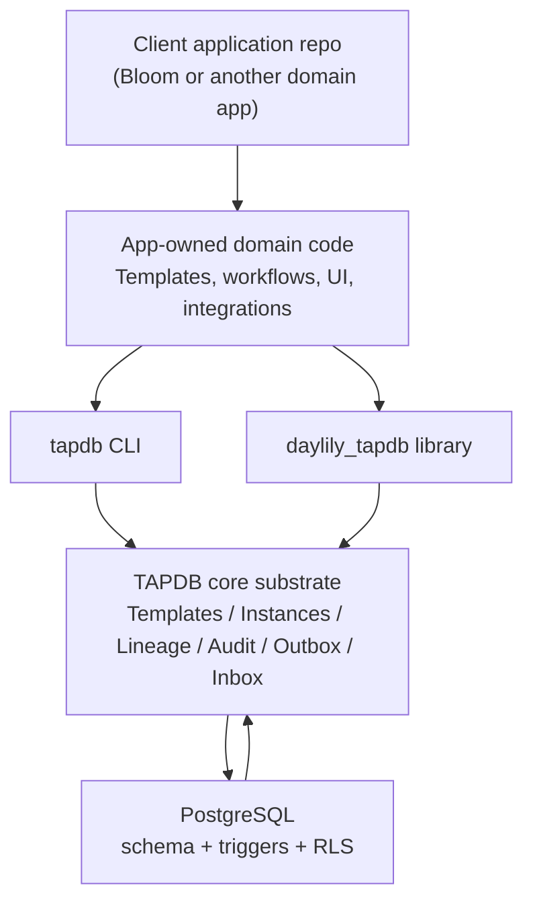

# Templated Abstract Polymorphic Database

Templated Abstract Polymorphic Database, or TAPDB, is a reusable PostgreSQL-backed substrate for typed, versioned, auditable entities.

It is intentionally not a domain application. TAPDB provides the generic persistence and runtime mechanics that higher-level repos use to model their own business objects. Bloom is a motivating example of the kind of system TAPDB supports, but Bloom-specific workflow semantics do not belong in TAPDB itself.

At a high level TAPDB combines:

- SQLAlchemy polymorphic models over a small, schema-stable core
- template packs that define object shape and behavior
- concrete instances created from those templates
- lineage edges that describe relationships and history
- audit, outbox, and inbox tables that preserve change and delivery state
- explicit domain, application, and tenant scoping



## Quickstart

The repo follows a CLI-first workflow. Start by activating the repo environment:

```bash
source ./activate
```

The canonical operational form for runtime commands is:

```bash
tapdb --config <path> --env <name> ...
```

Smoke the installed CLI surface first:

```bash
tapdb --help
tapdb version
bash examples/readme/00_smoke.sh
```

For a fuller local bootstrap, use the namespaced config flow and then bring up the local runtime:

```bash
tapdb --config ~/.config/tapdb/<client-id>/<database-name>/tapdb-config.yaml \
  config init \
  --client-id <client-id> \
  --database-name <database-name> \
  --euid-client-code <client-code> \
  --env dev \
  --db-port dev=5533 \
  --ui-port dev=8911

tapdb --config ~/.config/tapdb/<client-id>/<database-name>/tapdb-config.yaml \
  --env dev \
  bootstrap local --no-gui

tapdb --config ~/.config/tapdb/<client-id>/<database-name>/tapdb-config.yaml \
  --env dev \
  info --json
```

If optional workflow packs are present in the config, add `--include-workflow` to the bootstrap command. If you want the generated scripts rather than inline commands, use the companion examples under `examples/readme/`:

- `examples/readme/00_smoke.sh`
- `examples/readme/10_bootstrap_local.sh`
- `examples/readme/20_python_api.py`

## Mental Model

TAPDB’s core model is deliberately small:

- `template`: a blueprint, stored as a `generic_template` row and usually seeded from JSON packs
- `instance`: a concrete object, stored as a `generic_instance` row and created from a template
- `lineage`: a directed relationship, stored as `generic_instance_lineage`
- `audit`: immutable change history in `audit_log`
- `outbox`: durable dispatch state for cross-service delivery
- `inbox`: durable receipt state for inbound messages

The library surface is built around those concepts:

- `TemplateManager` resolves template codes to seeded templates
- `InstanceFactory` materializes instances from templates
- lineage helpers traverse parent/child relationships
- outbox helpers enqueue, claim, deliver, and record message attempts

The important mental shift is that template packs describe shape, not business truth. Application repos own domain semantics and TAPDB stores the substrate that those semantics sit on.

## Identity And Scope

TAPDB uses multiple identity layers on purpose:

- `uid` is the internal BIGINT primary key
- `euid` is the external Meridian identifier used on labels, links, APIs, and human-facing references
- `domain_code` scopes a row or identifier to a Meridian domain
- `issuer_app_code` records the issuing application and is not part of the EUID string
- `tenant_id` is the database tenancy scope and is separate from Meridian domain scoping

Do not infer business meaning from an EUID prefix. EUIDs are opaque by design. The string helps validation and transport; the real meaning lives in database lookup and application context.

## Boundaries

TAPDB owns:

- template seeding and validation
- polymorphic persistence
- lineage and graph traversal
- audit and soft-delete behavior
- outbox/inbox delivery state
- CLI-managed runtime and database lifecycle

Application repos own:

- domain semantics
- domain template packs
- workflow rules and business policy
- UI and API affordances on top of TAPDB
- integration-specific behavior

That boundary is the point of the project. TAPDB is the substrate, not the business system.

## Docs

- [docs/README.md](docs/README.md)
- [docs/architecture.md](docs/architecture.md)
- [docs/identity-and-scoping.md](docs/identity-and-scoping.md)
- [docs/runtime-and-cli.md](docs/runtime-and-cli.md)
- [docs/tapdb_gui_inclusion.md](docs/tapdb_gui_inclusion.md)
