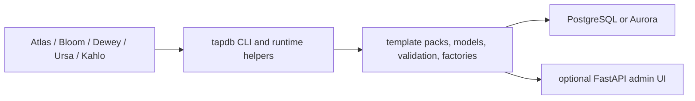

[](https://github.com/Daylily-Informatics/daylily-tapdb/releases)
[](https://github.com/Daylily-Informatics/daylily-tapdb/tags)
[](https://github.com/Daylily-Informatics/daylily-tapdb/actions/workflows/ci.yml)

# daylily-tapdb

`daylily-tapdb` is the shared persistence layer used by Bloom, Atlas, Dewey, Ursa, and Kahlo. It provides the template-driven object model, the lineage and audit primitives, the bootstrap/runtime CLI, and an optional admin UI package.

TapDB owns:
- the canonical core template-pack model
- template validation and loading behavior
- generic instance, lineage, audit, and outbox primitives
- shared database/bootstrap/runtime lifecycle
- the optional admin UI package

TapDB does not own:
- client-domain truth such as Atlas orders or Bloom lab state
- client-authored template packs outside the core package
- product-specific UI composition in parent apps

If you are trying to understand how the stack persists typed objects and lineage without handing domain ownership to one monolith, this repo is the substrate.

## Component View



## Prerequisites

- Python 3.10+
- PostgreSQL for local or shared runtime work
- optional Aurora credentials and AWS access for Aurora flows
- optional `admin` extra for the admin UI

## Getting Started

### Quickstart

```bash
source ./activate
tapdb --config ~/.config/tapdb/tapdb/tapdb/tapdb-config.yaml config init \
  --client-id tapdb \
  --database-name tapdb \
  --env dev \
  --db-port dev=5533 \
  --ui-port dev=8911
tapdb --config ~/.config/tapdb/tapdb/tapdb/tapdb-config.yaml --env dev bootstrap local
```

## Architecture

### Technology

- SQLAlchemy declarative models with polymorphic inheritance
- Typer-based `tapdb` CLI
- PostgreSQL for local and Aurora-backed runtimes
- optional FastAPI + Jinja2 admin UI

### Core Object Model

| Table / concept | Purpose |
| --- | --- |
| `generic_template` | canonical template definitions |
| `generic_instance` | instantiated typed objects |
| `generic_instance_lineage` | parent/child and related graph edges |
| `audit_log` | append-only change history |
| `outbox_event` | integration/event handoff staging |
| `uid` | BIGINT internal key |
| `euid` | public business identifier |
| `tenant_id` | UUID isolation key |

The packaged `daylily_tapdb/core_config` directory is the canonical TapDB core template pack. Client repos may define their own JSON packs under `config/tapdb_templates/`, but they should load them through TapDB instead of mutating templates directly at runtime.

### Runtime Shape

- CLI: `tapdb`
- primary groups: `bootstrap`, `ui`, `config`, `db`, `pg`, `user`, `cognito`, `aurora`
- admin UI can run standalone or be mounted into a parent FastAPI app

### Parent-App Embedding

The intended embedding pattern is:

- parent app owns `FastAPI()` creation
- parent app owns auth/session/trusted-host behavior
- TapDB is used as a library/runtime substrate
- template packs are seeded from JSON packs, not written ad hoc in product code

## Cost Estimates

Approximate only.

- Local development: workstation plus a PostgreSQL instance.
- Shared dev host: modest database and storage cost, usually low tens to low hundreds per month depending on host size and retention.
- Aurora-backed use: materially higher than local due to managed database pricing and networking, but still usually a shared substrate cost for several services rather than a TapDB-only budget line.

## Development Notes

- Canonical local entry path: `source ./activate`
- Use `tapdb ...` for database lifecycle operations rather than raw SQL or shell shortcuts
- Runtime commands should use explicit `--config` and `--env`

Useful checks:

```bash
source ./activate
tapdb --help
tapdb --config ~/.config/tapdb/tapdb/tapdb/tapdb-config.yaml --env dev info
pytest tests/ -q --deselect tests/test_admin_routes_smoke.py
```

## Sandboxing

- Safe: docs work, `tapdb --help`, config inspection, template-pack validation, and tests against disposable local runtimes
- Local-stateful: schema apply/bootstrap and local PostgreSQL start/reset commands
- Requires extra care: Aurora operations, destructive reset/delete flows, and any manual intervention outside the intended CLI

## Current Docs

- [Docs index](docs/README.md)
- [GUI inclusion guide](docs/tapdb_gui_inclusion.md)

## References

- [SQLAlchemy](https://www.sqlalchemy.org/)
- [FastAPI](https://fastapi.tiangolo.com/)
- [PostgreSQL](https://www.postgresql.org/)
 
 
