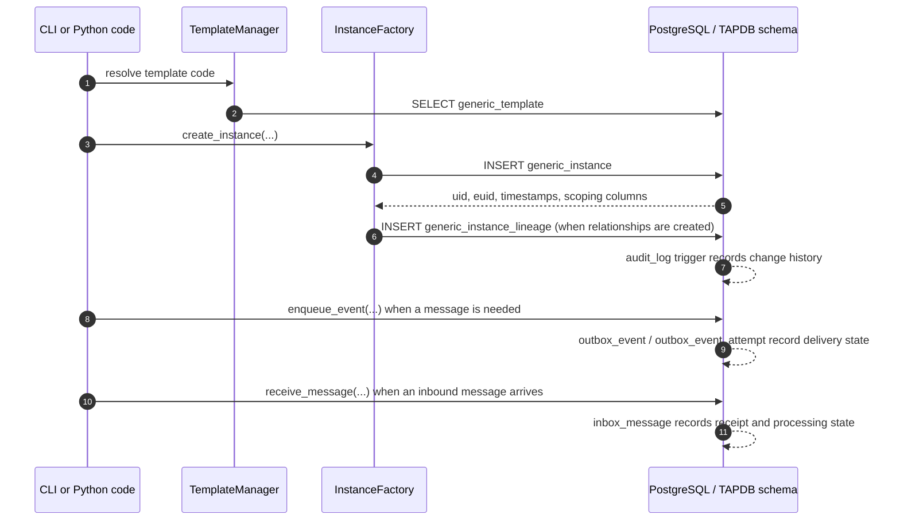

# TAPDB Architecture

This document describes the `tapdb-core` repository. The Python import package remains `daylily_tapdb`.

TAPDB is a small substrate with a large surface area. The point of the design is not to be clever; it is to keep the durable pieces generic so that application repos can stay domain-specific without re-implementing the persistence layer.

The current architecture centers on these principles:

- schema-stable core tables
- SQLAlchemy polymorphism for typed entities
- template packs as the source of object shape
- lineage as the authoritative relationship graph
- explicit `uid`, `euid`, `domain_code`, `issuer_app_code`, and `tenant_id` separation
- audit, outbox, and inbox state preserved inside PostgreSQL
- CLI-driven lifecycle management

## Core Tables

| Table | Role |
| --- | --- |
| `generic_template` | Blueprint rows seeded from template packs |
| `generic_instance` | Concrete rows created from templates |
| `generic_instance_lineage` | Directed relationships between instances |
| `audit_log` | Change history and traceability |
| `outbox_event` | Delivery index for transactional outbox messages |
| `outbox_event_attempt` | Attempt history for outbox delivery |
| `inbox_message` | Durable receipt and processing state for inbound messages |

The ORM maps typed subclasses onto those tables with polymorphic identities. The type hierarchy lives in the model layer; the data stays in the core schema.

## Write Path

The typical write path looks like this:

That path is intentionally explicit. TAPDB does not hide relationships inside JSON blobs, and it does not silently promote app-specific semantics into the substrate.

## Identity Layers

TAPDB uses several identity layers that should not be conflated:

- `uid`: internal BIGINT database identity
- `euid`: external Meridian EUID
- `domain_code`: Meridian namespace scope
- `issuer_app_code`: issuing application metadata
- `tenant_id`: application tenancy scope

The repository code, schema, and CLI all follow that separation. A row can be globally visible, domain-scoped, or tenant-scoped depending on its use case, but those concerns remain distinct.

## Runtime Surfaces

The codebase exposes three main surfaces:

- the `tapdb` CLI for config, bootstrap, schema, runtime, UI, and auth lifecycle
- the Python library for application code that needs to resolve templates or create instances
- PostgreSQL for authoritative storage, triggers, and row-level scoping

The CLI is the operational boundary. Runtime commands are always namespaced with `--config <path>` and `--env <name>`, because TAPDB is designed to be used by more than one client and more than one environment at once.

## What TAPDB Is Not

TAPDB is not:

- a domain-specific workflow engine
- a generic event bus
- a replacement for application business logic
- a UUID system
- a place to encode domain meaning into EUID strings

That separation is what makes the substrate reusable. Bloom, or any other client repo, can build a rich domain model on top without forcing TAPDB to become the domain itself.
