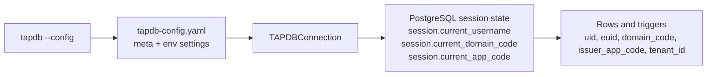

# TAPDB Identity and Scoping

TAPDB has five different identity or scope concepts that often get conflated:
`uid`, `euid`, `domain_code`, `issuer_app_code`, and `tenant_id`.

The short version is:

- `uid` is the internal database primary key.
- `euid` is the external Meridian identifier used for labels, URLs, and human-facing references.
- `domain_code` scopes data and issuance to a Meridian domain namespace.
- `issuer_app_code` scopes issuance and row-level filtering to the application that minted or handled the row.
- `tenant_id` scopes data to a tenant and is independent from Meridian identity.

TAPDB is intentionally built so that the external identifier is opaque. The
meaning of an object comes from database lookup and template metadata, not from
the shape of the identifier string.

## Identity Layers

| Value | What it is | What it is not |
| --- | --- | --- |
| `uid` | `BIGINT` primary key generated by the database | Not a Meridian identifier, not a tenant ID, not a label |
| `euid` | Meridian Enterprise Unique Identifier | Not a UUID and not a semantic payload |
| `domain_code` | Meridian domain namespace / RLS scope | Not a tenant, not an app code |
| `issuer_app_code` | Issuing application scope / RLS scope | Not part of the EUID string |
| `tenant_id` | Multi-tenant UUID scope | Not Meridian identity and not part of the EUID string |

The runtime and schema use these layers together:

- `uid` is used for joins and foreign keys.
- `euid` is what people tend to see and copy.
- `domain_code` and `issuer_app_code` are session-scoped safety rails.
- `tenant_id` is a separate UUID scope used by row-level policies and app-level filtering.

## Meridian EUIDs

TAPDB follows Meridian 0.3.2 terminology and examples.

Production EUID:

```text
DNA-C1SJ
```

Domain-scoped EUID:

```text
DEV:DNA-ME9
```

Important rules:

- EUIDs are opaque.
- Do not infer object type, routing, tenant, workflow state, or app behavior from the string.
- Do not handcraft EUIDs.
- Do not normalize lowercase, whitespace, or visually similar characters.
- Do not use UUIDs in place of EUIDs.

In TAPDB, the external identifier is generated from sequence-backed integers and
validated with Meridian checksum rules. The string carries almost no business
meaning beyond validation and namespace separation.

## Current Runtime Context

TAPDB has two layers of runtime context:

1. CLI/config namespace context.
2. PostgreSQL session context.

### CLI / Config Namespace

The supported CLI form is:

```bash
tapdb --config <path> --env <name> ...
```

The config file is a namespace-scoped YAML file, usually at:

```text
~/.config/tapdb/<client>/<database>/tapdb-config.yaml
```

The config metadata includes:

- `meta.client_id`
- `meta.database_name`
- `meta.euid_client_code`

`meta.euid_client_code` is used to derive the namespace-scoped core prefix for
seeded TAPDB template packs. It is separate from the Meridian `domain_code`.

### PostgreSQL Session Context

The Python connection layer sets session values before work begins:

- `session.current_username` for audit attribution.
- `session.current_domain_code` for Meridian domain scope.
- `session.current_app_code` for issuer app scope.

See [`daylily_tapdb/connection.py`](../daylily_tapdb/connection.py) and
[`schema/tapdb_schema.sql`](../schema/tapdb_schema.sql) for the current contract.

The SQL layer resolves these session values as follows:

- `tapdb_current_domain_code()` rejects missing session state.
- `tapdb_current_app_code()` rejects missing session state.
- explicit empty strings are rejected.

The Python connection layer follows the same fail-fast contract:

- `domain_code` must be passed explicitly or supplied via `MERIDIAN_DOMAIN_CODE`.
- `issuer_app_code` must be passed explicitly or supplied via `TAPDB_APP_CODE`.

Application code should always set both values deliberately. There is no
implicit fallback domain.

## Row-Level Scope

TAPDB row-level policies use `domain_code`, `issuer_app_code`, and `tenant_id`
together. The important point is that each scope answers a different question:

- `domain_code`: which Meridian domain is this row valid in?
- `issuer_app_code`: which application domain minted or is handling this row?
- `tenant_id`: which tenant does this row belong to?

Do not substitute one for another.



## Practical Rules

- Use `uid` for internal joins and foreign keys.
- Use `euid` for external references and human-facing object identity.
- Use `domain_code` for Meridian namespace separation.
- Use `issuer_app_code` for application-level issuance scope.
- Use `tenant_id` for tenancy.
- Treat `euid` as opaque lookup data, not as business logic.
