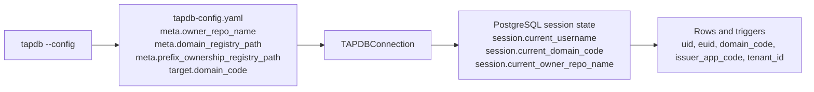

# TAPDB Identity and Scoping

TAPDB keeps five identity or scope concepts separate: `uid`, `euid`,
`domain_code`, `issuer_app_code`, and `tenant_id`.

The short version is:

- `uid` is the internal database primary key.
- `euid` is the external Meridian identifier used for labels, URLs, and
  user-facing references.
- `domain_code` is the required Meridian domain namespace.
- `issuer_app_code` is the persisted owner token column used by row-level scope.
  In TapDB 0.4.1 the value stored there is the repo-name ownership token.
- `tenant_id` is the tenant UUID and is independent from Meridian identity.

TapDB treats the external identifier as opaque. Object meaning comes from
database lookup and template metadata, not from parsing the identifier text.

## Identity Layers

| Value | What it is | What it is not |
| --- | --- | --- |
| `uid` | `BIGINT` primary key generated by the database | Not a Meridian identifier, not a tenant ID, not a label |
| `euid` | Meridian Enterprise Unique Identifier | Not a UUID and not a semantic payload |
| `domain_code` | Meridian domain namespace / RLS scope | Not a tenant and not folded into template category |
| `issuer_app_code` | Persisted owner token / RLS scope column | Not a separate TapDB app-code concept |
| `tenant_id` | Multi-tenant UUID scope | Not Meridian identity and not part of the EUID string |

These layers are used together:

- `uid` is used for joins and foreign keys.
- `euid` is what people see and copy.
- `domain_code` is mandatory for issuance and template resolution.
- `issuer_app_code` stores the repo-name ownership token used for row scope.
- `tenant_id` remains separate tenancy state.

## Meridian EUIDs

TapDB follows Meridian EUID v0.4.1 canonical formatting:

```text
DOMAIN-PREFIX-BODYCHECKSUM
```

Example:

```text
Z-AGX-1AD
```

Important rules:

- Domain is required.
- Prefix is required.
- `:` forms and domainless forms are rejected.
- EUIDs are opaque.
- Do not infer object type, tenant, workflow state, or routing from the string.
- Do not handcraft EUIDs.
- Do not substitute UUIDs for EUIDs.

## Runtime Context

TapDB has two relevant runtime layers:

1. CLI/config namespace context.
2. PostgreSQL session context.

### CLI / Config Namespace

The supported CLI form is:

```bash
tapdb --config <path> ...
```

The config metadata must include:

- `meta.client_id`
- `meta.database_name`
- `meta.owner_repo_name`
- `meta.domain_registry_path`
- `meta.prefix_ownership_registry_path`
- `target.domain_code`
- `target.database`
- `target.schema_name`

There is no client-code-derived prefix behavior, no passive prefix inheritance,
and no compatibility path for missing governance metadata.

### PostgreSQL Session Context

The Python connection layer sets session values before work begins:

- `session.current_username` for audit attribution
- `session.current_domain_code` for Meridian domain scope
- `session.current_owner_repo_name` for repo ownership scope

The SQL layer rejects missing session state. Application code must provide both
domain and owner repo deliberately.

Runtime ownership inputs:

- `MERIDIAN_DOMAIN_CODE`
- `TAPDB_OWNER_REPO`

There is no fallback domain, no fallback owner token, and no separate legacy
app-code mode.

## Template Scope

Template taxonomy remains:

```text
category/type/subtype/version/
```

In TapDB, `category` is the Meridian prefix. Domain is separate and mandatory.
The effective template identity is:

```text
(domain_code, category, type, subtype, version)
```

Domainless template lookup is forbidden. All template queries and uniqueness
checks must include `domain_code`.

## Row-Level Scope

TapDB row-level policies use `domain_code`, `issuer_app_code`, and `tenant_id`
together:

- `domain_code`: which Meridian domain is this row valid in?
- `issuer_app_code`: which repo ownership token minted or handles this row?
- `tenant_id`: which tenant does this row belong to?

Do not substitute one for another.



## Practical Rules

- Use `uid` for internal joins and foreign keys.
- Use `euid` for external references and user-facing object identity.
- Use `domain_code` for Meridian namespace separation.
- Use `owner_repo_name` / `TAPDB_OWNER_REPO` as the runtime ownership input.
- Treat persisted `issuer_app_code` values as the repo-name ownership token.
- Use `tenant_id` only for tenancy.
- Treat `euid` as opaque lookup data, not business logic.
