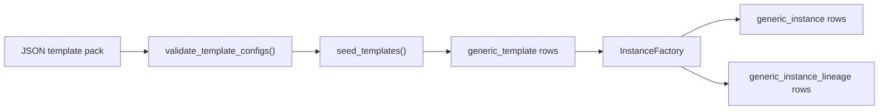

# TAPDB Template Authoring

TapDB templates define the reusable object model. Instances are concrete rows
created from templates, and lineage is where authoritative relationships live.

The practical rule is simple:

- templates describe what may exist
- instances describe what does exist
- lineage describes how objects are related

## Pack Ownership

TapDB ships only a minimal built-in operational core pack. Domain or product
templates live outside this repository and are seeded explicitly.

Current built-in core templates are:

- `SYS/actor/system_user/1.0`
- `MSG/message/webhook_event/1.0`

There is no passive inheritance of generic client-usable prefixes from TapDB
core.

## JSON Pack Shape

Template packs are JSON documents with a top-level `templates` array.

Minimal shape:

```json
{
  "templates": [
    {
      "name": "System User",
      "polymorphic_discriminator": "actor_template",
      "category": "SYS",
      "type": "actor",
      "subtype": "system_user",
      "version": "1.0",
      "instance_prefix": "SYS",
      "bstatus": "active",
      "is_singleton": false,
      "json_addl": {
        "description": "TapDB system user template",
        "properties": {
          "name": "System User"
        },
        "action_imports": {},
        "instantiation_layouts": []
      }
    }
  ]
}
```

The loader validates:

- required string fields
- JSON schema shape
- template code uniqueness
- cross-references in action imports and instantiation layouts
- governance-backed prefix ownership

## Template Codes

Template taxonomy remains:

```text
category/type/subtype/version/
```

Examples:

- `SYS/actor/system_user/1.0/`
- `MSG/message/webhook_event/1.0/`
- `AGX/logistics/shipment/1.0/`

In TapDB, `category` is the Meridian prefix. Domain is separate and required.
The effective template identity is:

```text
(domain_code, category, type, subtype, version)
```

There is no supported lookup path that resolves `category/type/subtype/version`
without domain.

## `instance_prefix`

`instance_prefix` is the prefix used when a template mints instance EUIDs.

Rules:

- It must be an approved Meridian prefix.
- It must be registered for the active domain.
- Its registered owner must match the calling repo name.
- It should match the template `category` used for that template family.

There is no placeholder `GX` rewrite behavior and no client-scoped prefix
derivation during seeding.

## Seeding And Validation

Seeding is a loader operation, not ad hoc ORM mutation.

The hard-cut flow is:

1. load template JSON packs
2. validate structure and references
3. require explicit `domain_code`
4. require explicit `owner_repo_name`
5. validate domain and prefix ownership against the shared registries
6. seed TapDB operational templates first
7. seed client/domain packs second

The loader rejects:

- invalid JSON
- missing required fields
- duplicate template keys within the same domain-scoped identity
- invalid `action_imports` / `instantiation_layouts`
- unregistered domains
- unregistered prefixes
- prefixes claimed by another repo
- domainless template operations

## Mutation Guard

Templates are protected from direct ORM writes by a session-level guard.

Client code cannot freely insert, update, or delete template rows unless the
execution context explicitly opts into template mutation. The normal path is to
use the JSON loader and seeding flow.

Relevant pieces:

- `TemplateMutationGuardError`
- `allow_template_mutations()`
- the `Session.before_flush` hook on `generic_template`

## Action Imports

Templates may import actions through `json_addl.action_imports`.

Example:

```json
{
  "action_imports": {
    "create_note": "action/core/create-note/1.0"
  }
}
```

At runtime, `materialize_actions()` resolves each imported action template in
the active domain and expands it into an action group named
`{type}_actions`.

## Instantiation Layouts

Instantiation layouts define child object creation from a parent template.

They are validated as structured layout data and may reference child templates
as either strings or small objects with a `template_code` field.

Example:

```json
{
  "instantiation_layouts": [
    {
      "relationship_type": "contains",
      "child_templates": [
        "workflow_step/queue/available/1.0"
      ]
    }
  ]
}
```

The factory uses these layouts to create child instances and lineage rows.
Those lineage rows are authoritative. The JSON layout is only the authoring
input.

## Lineage Is Authoritative

- copied JSON references are lookup metadata
- `generic_instance_lineage` rows are the source of truth for relationships
- traversal helpers read lineage, not template JSON

See [`daylily_tapdb/lineage.py`](../daylily_tapdb/lineage.py) and
[`daylily_tapdb/factory/instance.py`](../daylily_tapdb/factory/instance.py).



## Practical Authoring Rules

- Keep the built-in core pack minimal and operational.
- Put domain/business templates in repo-owned packs outside TapDB core.
- Use `template_code` strings for declarative references.
- Register prefixes by domain before seeding.
- Pass domain explicitly in every template lookup and seeding operation.
- Treat lineage as the authoritative relationship graph.
