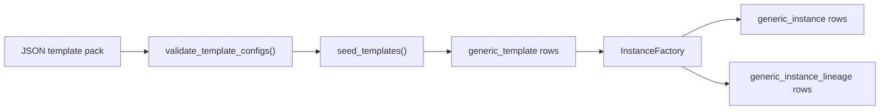

# TAPDB Template Authoring

TapDB templates define the reusable object model. Instances are concrete rows
created from templates, and lineage is where authoritative relationships live.

The practical rule is simple:

- templates describe what may exist,
- instances describe what does exist,
- lineage describes how objects are related.

## Pack Ownership

TAPDB ships a minimal built-in core pack. Client or domain-specific template
packs live outside the repository and are seeded explicitly.

Current core pack directories are packaged under
[`daylily_tapdb/core_config`](../daylily_tapdb/core_config).

The built-in core pack is intentionally small and substrate-oriented. It exists
to support the shared runtime, not to encode client business semantics.

## JSON Pack Shape

Template packs are JSON documents with a top-level `templates` array.

Minimal shape:

```json
{
  "templates": [
    {
      "name": "Generic Object",
      "polymorphic_discriminator": "generic_template",
      "category": "generic",
      "type": "generic",
      "subtype": "generic",
      "version": "1.0",
      "instance_prefix": "GX",
      "bstatus": "active",
      "is_singleton": false,
      "json_addl": {
        "description": "Base generic object template",
        "properties": {
          "name": "Generic Object"
        },
        "action_imports": {},
        "instantiation_layouts": []
      }
    }
  ]
}
```

The loader validates:

- required string fields
- JSON schema shape
- template code uniqueness
- cross-references in action imports and instantiation layouts
- reserved prefix rules for core versus client packs

Common optional fields you should expect to see in packs:

- `json_addl_schema`: optional JSON Schema for instance payload validation.
- `instance_polymorphic_identity`: optional override for the instance-side
  SQLAlchemy discriminator.
- `bstatus`: business status for the template, usually `active`.
- `is_singleton`: whether only one instance should exist for the template.

See [`daylily_tapdb/templates/loader.py`](../daylily_tapdb/templates/loader.py).

## Template Codes

Template identity is the four-part code:

```text
category/type/subtype/version/
```

Examples:

- `generic/generic/generic/1.0/`
- `generic/actor/system_user/1.0/`
- `system/message/webhook_event/1.0/`

That code is what the loader and `TemplateManager` use to resolve a template.
The `polymorphic_discriminator` controls SQLAlchemy inheritance, while the
template code is the stable human-readable authoring key.

## `instance_prefix`

`instance_prefix` is the prefix used when a template mints instance EUIDs.

Rules:

- Bundled core templates must use the placeholder prefix `GX` in JSON.
- Client templates must not persist the reserved core prefixes `GX` or `TGX`.
- During seeding, core templates are rewritten to the namespace-scoped prefix
  derived from `meta.euid_client_code`, such as `CGX`.

This keeps bundled core packs portable while still allowing each namespace to
mint its own identifiers.

## Seeding And Validation

Seeding is a loader operation, not ad hoc ORM mutation.

The current flow is:

1. load template JSON packs
2. validate structure and references
3. ensure prefixes and sequences exist
4. seed core pack first
5. seed client packs second

The loader rejects:

- invalid JSON
- missing required fields
- duplicate template keys
- invalid `action_imports` / `instantiation_layouts`
- reserved prefix misuse
- references to templates that are not present in the configured set when
  strict validation is enabled

This is the current contract in
[`daylily_tapdb/templates/loader.py`](../daylily_tapdb/templates/loader.py).

## Mutation Guard

Templates are protected from direct ORM writes by a session-level guard.

Client code cannot freely insert, update, or delete template rows unless the
execution context explicitly opts into template mutation. The normal path is to
use the JSON loader and seeding flow.

Relevant pieces:

- `TemplateMutationGuardError`
- `allow_template_mutations()`
- the `Session.before_flush` hook on `generic_template`

In practice, that means template authoring happens through packs and loader
code, not through application code that casually mutates the ORM.

## Action Imports

Templates may import actions through `json_addl.action_imports`.

Example:

```json
{
  "action_imports": {
    "create_note": "action/core/create-note/1.0"
  }
}
```

At runtime, `materialize_actions()` resolves each imported action template and
expands it into an action group named `{type}_actions`.

The resulting runtime action payload includes:

- `action_template_uid`
- `action_template_euid`
- `action_template_code`
- the action definition from the imported template

The important point is that imports are declarative template references. They
do not create authoritative relationships by themselves.

## Instantiation Layouts

Instantiation layouts define child object creation from a parent template.

They are validated as structured layout data and may reference child templates
as either strings or small objects with a `template_code` field.

Example:

```json
{
  "instantiation_layouts": [
    {
      "relationship_type": "contains",
      "child_templates": [
        "workflow_step/queue/available/1.0"
      ]
    }
  ]
}
```

The factory uses these layouts to create child instances and lineage rows.
Those lineage rows are authoritative. The JSON layout is only the authoring
input.

## Lineage Is Authoritative

This is one of the most important TAPDB rules:

- copied JSON references are lookup metadata,
- `generic_instance_lineage` rows are the source of truth for relationships,
- traversal helpers read lineage, not template JSON.

That separation keeps the object graph auditable and prevents the template pack
from becoming a hidden database of relationships.

See [`daylily_tapdb/lineage.py`](../daylily_tapdb/lineage.py) and
[`daylily_tapdb/factory/instance.py`](../daylily_tapdb/factory/instance.py).



## Practical Authoring Rules

- Keep the built-in core pack minimal and substrate-focused.
- Put domain/business templates in client-owned packs, not in TAPDB core.
- Use `template_code` strings for declarative references.
- Use `instance_prefix` carefully; it is part of the identifier contract.
- Treat lineage as the authoritative relationship graph.
- Do not rely on template JSON as the canonical source of object relationships.
