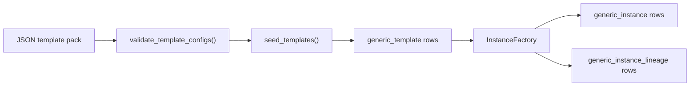

# TAPDB Template Authoring

TapDB templates define the reusable object model. Instances are concrete rows
created from templates, and lineage is where authoritative relationships live.

The practical rule is simple:

- templates describe what may exist
- instances describe what does exist
- lineage describes how objects are related

## Pack Ownership

TapDB ships only a minimal built-in operational core pack. Domain or product
templates live outside this repository and are seeded explicitly.

Current built-in core templates are exactly:

- `actor/user/system/1.0`
- `set/generic/generic/1.0`
- `governance/validator/definition/1.0`
- `governance/terminology/set/1.0`
- `governance/relationship/constraint/1.0`
- `governance/position/scheme/1.0`
- `evidence/repair/record/1.0`
- `message/webhook/event/1.0`
- `reference/external_identifier/tapdb_object/1.0`
- `reference/external_identifier/opaque/1.0`

There is no passive inheritance of generic client-usable prefixes from TapDB
core.

For each configured owner scope, an authenticated database operator seeds the
exact ten definitions shipped in TapDB's installed core directory. The
persisted template rows use that configured owner so the owner's NOBYPASSRLS
runtime can create same-owner System User, external-reference, message, and
lineage objects. This is a bounded core operation, not a client prefix claim:
reserved-prefix delegation requires an exact installed source coordinate and
exact bundled content. A client pack cannot gain `SYS`, `XRF`, `MSG`, `GVR`,
`GSE`, `TPX`, `EDG`, or `ADT` merely by copying a path or template shape.

`actor/user/system/1.0` exists for the optional bundled GUI/auth subsystem. It
is not a universal business-domain primitive; future extraction of that
optional subsystem is tracked by issue #12. A cross-service relationship uses
the separate typed `reference/external_identifier/tapdb_object/1.0` object plus
lineage and must never reuse System User as an external-reference surrogate.

## JSON Pack Shape

Template packs are JSON documents with a top-level `templates` array.

Minimal shape:

```json
{
  "templates": [
    {
      "name": "Sample",
      "polymorphic_discriminator": "generic_template",
      "category": "content",
      "type": "specimen",
      "subtype": "sample",
      "version": "1.0",
      "instance_prefix": "SMP",
      "bstatus": "active",
      "is_singleton": false,
      "json_addl": {
        "description": "Client-owned sample template",
        "properties": {
          "display_name": ""
        },
        "action_imports": {},
        "instantiation_layouts": []
      }
    }
  ]
}
```

The loader validates:

- required string fields
- JSON schema shape
- template code uniqueness
- cross-references in action imports and instantiation layouts
- governance-backed prefix ownership

## Template Codes

Template taxonomy remains:

```text
category/type/subtype/version/
```

Examples:

- `actor/user/system/1.0/`
- `message/webhook/event/1.0/`
- `reference/external_identifier/tapdb_object/1.0/`
- `container/plate/96well-generic/1.0/`
- `container/tube/1.5ml-eppi/1.0/`

In TapDB, `category` is the top-level object taxonomy bucket. Domain is
separate and required.
The effective template identity is:

```text
(domain_code, issuer_app_code, category, type, subtype, version)
```

There is no supported lookup path that resolves `category/type/subtype/version`
without both domain and the owner-scoping `issuer_app_code`.

## Repository-Owned Packs

`tapdb templates` manages deterministic, source-control-ready template packs.
These are not database backups and are not produced by `tapdb backup`. Use an
explicit absolute `.json` path whose parent directory already exists:

```bash
tapdb --config /abs/path/to/tapdb-config.yaml templates export \
  --repository-pack /abs/path/to/repository-template-pack.json
tapdb --config /abs/path/to/tapdb-config.yaml templates inventory \
  --repository-pack /abs/path/to/repository-template-pack.json
tapdb --config /abs/path/to/tapdb-config.yaml templates import \
  --repository-pack /abs/path/to/repository-template-pack.json --dry-run
tapdb --config /abs/path/to/tapdb-config.yaml templates import \
  --repository-pack /abs/path/to/repository-template-pack.json --apply
```

Export writes the canonical identity-free pack and an adjacent
`repository-template-pack.receipt.json` provenance receipt atomically. It
refuses to overwrite either file and makes the completed receipt read-only
(`0444`). The pack excludes database EUIDs, row timestamps, secrets, and
sequence state. The receipt records the pack basename, content checksum, domain
and owner claims, registry evidence, actor, source row EUIDs, and timestamps.
Commit or move the pack and receipt together without renaming either file:
basename storage makes the pair portable across checkout paths, while import
and inventory verify the basename, checksum, domain, and owner before using it.

Import is validation-only by default; the explicit `--dry-run` spelling is
equivalent and is suitable for operator runbooks. It persists missing templates
only with `--apply`. Inventory is read-only and reports the explicit pack
against the configured database; neither command searches for an alternate
pack.

Authenticated administrators can also choose **Download Canonical Pack** on
the Templates page. That response streams the same canonical, identity-free
JSON bytes as an `application/json` attachment; an optional exact stored
template EUID narrows the pack. Download creates no server-side file and no
provenance receipt. Use the explicit-path server-side export above when the
pack and its immutable receipt are required as a repository backup artifact.

## `instance_prefix`

`instance_prefix` is the prefix used when a template mints instance EUIDs.

Rules:

- It must be an approved Meridian prefix.
- It must be registered for the active domain.
- Its registered owner must match the calling repo name.
- The eight TapDB operational prefixes listed above are reserved and may appear
  only in the operator-authenticated exact bundled core inventory.
- It is independent of template taxonomy. For example, a
  `container/plate/96well-generic/1.0/` template may mint `PAT` instance EUIDs.

There is no placeholder `GX` rewrite behavior and no client-scoped prefix
derivation during seeding.

## Seeding And Validation

Seeding is a loader operation, not ad hoc ORM mutation.

The hard-cut flow is:

1. load template JSON packs
2. validate structure and references
3. require explicit `domain_code`
4. require explicit `owner_repo_name`
5. validate domain and prefix ownership against the shared registries
6. seed TapDB operational templates first
7. seed client/domain packs second

The loader rejects:

- invalid JSON
- missing required fields
- duplicate template keys within the same domain-and-owner-scoped identity
- invalid `action_imports` / `instantiation_layouts`
- unregistered domains
- unregistered prefixes
- prefixes claimed by another repo
- domainless template operations

## Mutation Guard

Templates are protected from direct ORM writes by a session-level guard.

Client code cannot freely insert, update, or delete template rows unless the
execution context explicitly opts into template mutation. The normal path is to
use the JSON loader and seeding flow.

Relevant pieces:

- `TemplateMutationGuardError`
- `allow_template_mutations()`
- the `Session.before_flush` hook on `generic_template`

## Action Imports

Templates may import actions through `json_addl.action_imports`.

Example:

```json
{
  "action_imports": {
    "create_note": "action/core/create-note/1.0"
  }
}
```

At runtime, `materialize_actions()` resolves each imported action template in
the active domain and expands it into an action group named
`{type}_actions`.

## Instantiation Layouts

Instantiation layouts define child object creation from a parent template.

They are validated as structured layout data and may reference child templates
as either strings or small objects with a `template_code` field.

Example:

```json
{
  "instantiation_layouts": [
    {
      "relationship_type": "contains",
      "child_templates": [
        "workflow_step/queue/available/1.0"
      ]
    }
  ]
}
```

The factory uses these layouts to create child instances and lineage rows.
Those lineage rows are authoritative. The JSON layout is only the authoring
input.

## Lineage Is Authoritative

- copied JSON references are lookup metadata
- `generic_instance_lineage` rows are the source of truth for relationships
- traversal helpers read lineage, not template JSON

See [`daylily_tapdb/lineage.py`](../daylily_tapdb/lineage.py) and
[`daylily_tapdb/factory/instance.py`](../daylily_tapdb/factory/instance.py).


```mermaid
flowchart LR
    PACK["JSON template pack"]
    VALIDATE["validate_template_configs()"]
    SEED["seed_templates()"]
    TEMPLATE["generic_template rows"]
    FACTORY["InstanceFactory"]
    INSTANCE["generic_instance rows"]
    LINEAGE["generic_instance_lineage rows"]

    PACK --> VALIDATE --> SEED --> TEMPLATE --> FACTORY --> INSTANCE
    FACTORY --> LINEAGE
```

## Practical Authoring Rules

- Keep the built-in core pack minimal and operational.
- Put domain/business templates in repo-owned packs outside TapDB core.
- Use `template_code` strings for declarative references.
- Register prefixes by domain before seeding.
- Pass domain explicitly in every template lookup and seeding operation.
- Treat lineage as the authoritative relationship graph.
